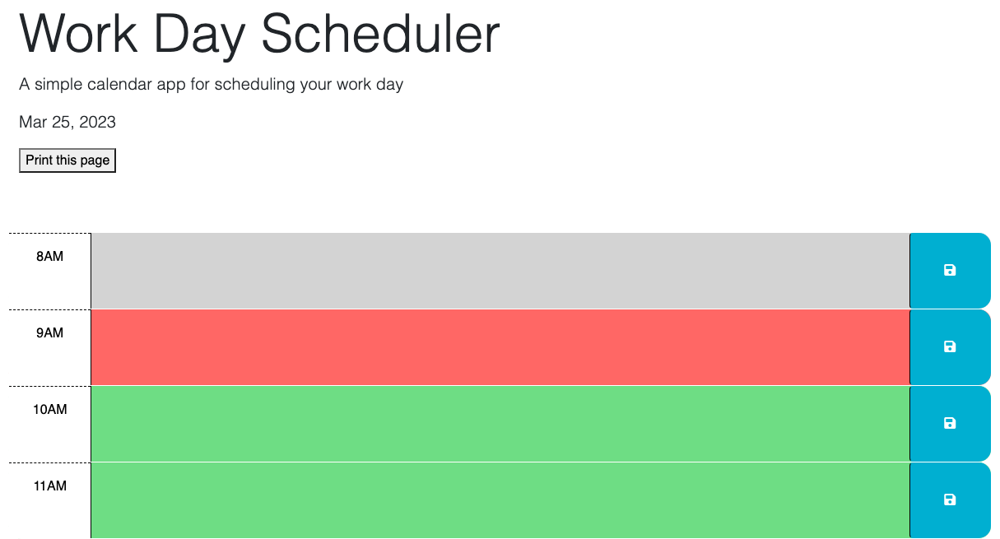

# <Work Day Scheduler>

## Description

I was tasked to refactor and add JavaScript functionality to get the scheduler to update  CSS styles dynamically and save important text in the schedulers text boxes. It was important to be able to save those items locally so when the page is reloaded your schedule is not cleared and you can manage your time more effectively. I used Day.JS and JQurey to achieve this 
## Installation

N/A

## Usage

Upon visiting the site, you will I see the current date in the Header and in the Body of the site depending on the hour of the day you’ll see gray, red, or green to indicate past current or future hours in the schedule. Upon inputting text and hitting the save button, you will be able to safely reload the page without losing the inputed text. As time goes on in the day, the page will change the CSS style from current to past and a future hour to the current hour.

 Check it out for yourself! [Work Day Scheduler Link Here](https://philippwinston.github.io/Work-Day-Scheduler/).

## Credits

## License

N/A
